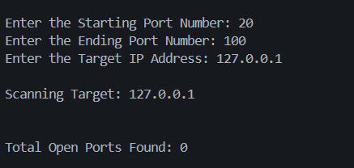
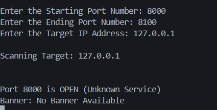

# Python Port Scanner v1.0

A beginner-friendly TCP port scanner built using Python sockets to explore networking fundamentals, service detection, banner grabbing, and cybersecurity reconnaissance concepts.

---

## 🚀 Features

- TCP Port Scanning
- Dynamic Port Range Selection
- Service Identification
- Banner Grabbing
- Input Validation
- Open Port Statistics

---

## 🧠 Concepts Used

- Socket Programming
- TCP Connections
- Ports & Services
- Banner Grabbing
- Client-Server Communication
- Input Validation
- Exception Handling

---

## 📸 Screenshots

### 🔹 Closed Port Scan


---

### 🔹 Open Port Detection


---

### 🔹 Invalid Input Handling


---

## ⚙️ How It Works

1. Takes target IP address
2. Takes custom port range
3. Attempts TCP connection using sockets
4. Detects open ports
5. Attempts banner grabbing
6. Displays scan summary

---

## 🛠 Tech Stack

- Python
- socket module

---

## ▶️ Usage

Run:

```bash
python port_scanner.py
```

---

## ⚠️ Limitations

- Sequential scanning (slow for large ranges)
- TCP only
- Basic banner grabbing
- No protocol-aware probing yet

---

## 🔮 Future Improvements

- Multithreading
- Faster scanning
- Protocol-aware banner grabbing
- Service fingerprinting
- Better reporting

---

## ⚠️ Ethical Note

Use this tool only on systems you own or are authorized to test.

---

## 🧑‍💻 Author

Advait Pathak
